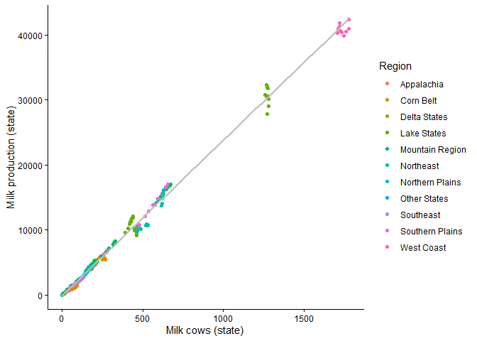
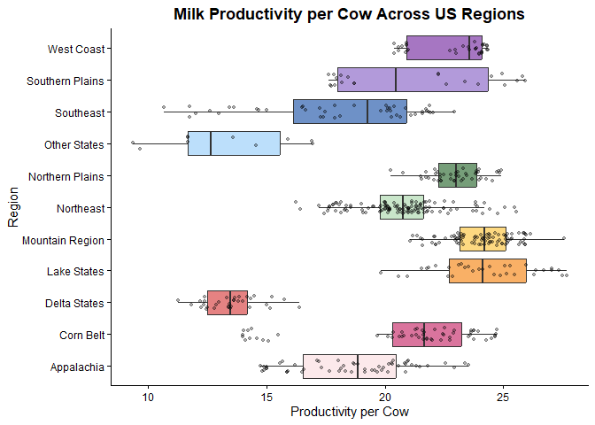
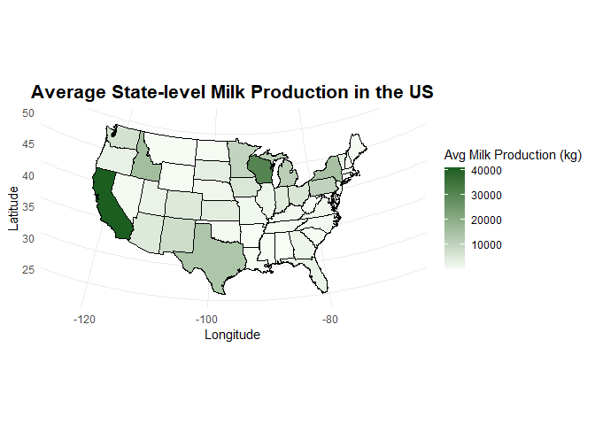
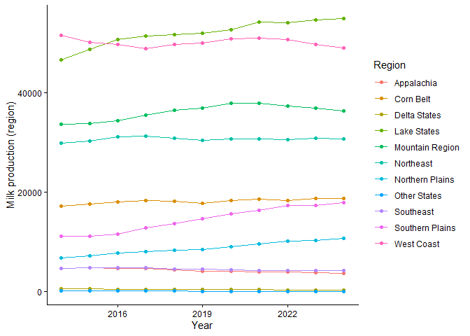
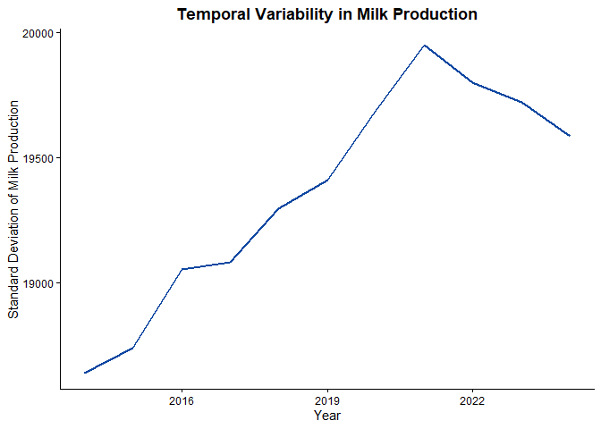

# FINAL PROJECT

## Descriptive Analysis of U.S. Milk Production Data

1.  Data and Source

This project will use publicly available U.S. milk production data,
including quarterly and the annual records. Data are provided by the
United States Department of Agriculture (USDA) and are freely available
from the USDA Data Catalog.

[DAIRY DATA ACCESS
USDA](https://www.ers.usda.gov/data-products/dairy-data) [Data
quarterly-milk-factors.csv](https://github.com/Matioli-amoc/PLPA6820--Final-Project-Amanda/blob/main/quarterly-milk-factors.csv)
[Data
milk-cows-and-prod.csv](https://github.com/Matioli-amoc/PLPA6820--Final-Project-Amanda/blob/main/milk-cows-and-prod.csv)

### Packages

    source("renv/activate.R")

    ## - The project is out-of-sync -- use `]8;;x-r-run:renv::status()renv::status()]8;;` for details.

    library(dplyr)

    ## 
    ## Attaching package: 'dplyr'

    ## The following objects are masked from 'package:stats':
    ## 
    ##     filter, lag

    ## The following objects are masked from 'package:base':
    ## 
    ##     intersect, setdiff, setequal, union

    library(tidyverse)

    ## Warning: package 'tidyverse' was built under R version 4.5.2

    ## ── Attaching core tidyverse packages ──────────────────────── tidyverse 2.0.0 ──
    ## ✔ forcats   1.0.1     ✔ readr     2.2.0
    ## ✔ ggplot2   4.0.2     ✔ stringr   1.6.0
    ## ✔ lubridate 1.9.5     ✔ tibble    3.3.1
    ## ✔ purrr     1.2.2     ✔ tidyr     1.3.2

    ## ── Conflicts ────────────────────────────────────────── tidyverse_conflicts() ──
    ## ✖ dplyr::filter() masks stats::filter()
    ## ✖ dplyr::lag()    masks stats::lag()
    ## ℹ Use the conflicted package (<http://conflicted.r-lib.org/>) to force all conflicts to become errors

    library(ggplot2)
    library(emmeans)

    ## Welcome to emmeans.
    ## Caution: You lose important information if you filter this package's results.
    ## See '? untidy'

    library(lme4)

    ## Loading required package: Matrix
    ## 
    ## Attaching package: 'Matrix'
    ## 
    ## The following objects are masked from 'package:tidyr':
    ## 
    ##     expand, pack, unpack

    library(multcompView)

    ## Warning: package 'multcompView' was built under R version 4.5.3

    library(usmap)
    library(maps)

    ## 
    ## Attaching package: 'maps'
    ## 
    ## The following object is masked from 'package:purrr':
    ## 
    ##     map

    library(mapdata)
    library(mapproj)

    cbbPalette <- c( "#FADADD", "#C2185B", "#D32F2F", "#F57C00", "#FBC02D",
      "#A5D6A7", "#1B5E20", "#90CAF9", "#0D47A1", "#7E57C2", "#6A1B9A")

    dir.create("figures", showWarnings = FALSE)

### Data:

    # Reading US data and regional/state data:

    Dairy.data.US <- read.csv("quarterly-milk-factors.csv", na.strings = c("#N/A", "NA", ""))

    Dairy.data.R <- read.csv("milk-cows-and-prod.csv", na.strings = c("#N/A", "NA", ""))

### File Tree

    ├── Dairy.m.csv
    ├── figures
    │   ├── Fig_boxplot.png
    │   ├── Fig_map.png
    │   ├── Fig_scatter.png
    │   ├── Fig_trend.png
    │   └── Fig_variability.png
    ├── Final Project.Rmd
    ├── Final-Project.html
    ├── Final-Project.md
    ├── Final-Project_files
    │   └── figure-markdown_strict
    │       ├── unnamed-chunk-10-1.png
    │       ├── unnamed-chunk-6-1.png
    │       ├── unnamed-chunk-7-1.png
    │       ├── unnamed-chunk-8-1.png
    │       └── unnamed-chunk-9-1.png
    ├── milk-cows-and-prod.csv
    ├── PLPA6820- Amanda Final Project.Rproj
    ├── quarterly-milk-factors.csv
    ├── README.md
    ├── renv
    │   ├── activate.R
    │   ├── library
    │   │   └── windows
    │   ├── settings.json
    │   └── staging
    └── renv.lock

### Cleaning:

Filter data equal or grater than 2014, and select variables (quality
control of 10 years):

    # keeping only annual data and last 10 years
    # selecting main variables for analysis
    Dairy.annual <- Dairy.data.US %>%
      filter(Period == "ANNUAL", Year >= 2014) %>%
      select(Year, Data_item, Value) %>%
      filter(Data_item %in% c("Milk cow", "Milk per cow", "Milk production")) %>%
      pivot_wider(names_from = Data_item, values_from = Value)

    # filtering regional data and removing totals
    # reshaping data to wide format
    Dairy.regional <- Dairy.data.R %>%
      filter(Table %in% c("Milk cows", "Milk per cow", "Milk production"),
             Data_item %in% c("Milk cows, average inventory", "Milk production per cow, average", "Milk production"),
             Year >= 2014, State != "Total region") %>%
      select(Year, State, Region, Table, Value) %>%
      pivot_wider(names_from = Table,
                  values_from = Value) %>%
      rename(Milk_cows_state = 'Milk cows',
             Milk_per_cows_state = 'Milk per cow',
             Milk_production_state = 'Milk production')

### Merging

    # merging regional and US data by Year
    ## Diry.m = state production + region

    Dairy.m <- left_join(Dairy.regional, Dairy.annual, by = "Year")

    ## milk_region = aggregated data by region to calculate linear models per regions

    Dairy.r <- Dairy.m %>%
      group_by(Year, Region) %>%
      summarise(
        Milk_cows_region = sum(Milk_cows_state, na.rm = TRUE),
        Milk_production_region = sum(Milk_production_state, na.rm = TRUE),
        Milk_per_cow_region = Milk_production_region / Milk_cows_region
      )

    ## `summarise()` has regrouped the output.
    ## ℹ Summaries were computed grouped by Year and Region.
    ## ℹ Output is grouped by Year.
    ## ℹ Use `summarise(.groups = "drop_last")` to silence this message.
    ## ℹ Use `summarise(.by = c(Year, Region))` for per-operation grouping
    ##   (`?dplyr::dplyr_by`) instead.

------------------------------------------------------------------------

### Analysis

Milk production data were analyzed using descriptive statistics, linear
regression, and correlation analysis to evaluate relationships between
herd size and production efficiency.

    # Linear model of Milk production and Milk cows

    lm1 <- lm(Milk_production_region ~ Milk_cows_region, data = Dairy.r)
    summary(lm1)

    ## 
    ## Call:
    ## lm(formula = Milk_production_region ~ Milk_cows_region, data = Dairy.r)
    ## 
    ## Residuals:
    ##     Min      1Q  Median      3Q     Max 
    ## -3817.7  -553.1    43.0   553.0  3798.3 
    ## 
    ## Coefficients:
    ##                   Estimate Std. Error t value Pr(>|t|)    
    ## (Intercept)      -552.9888   171.8045  -3.219  0.00166 ** 
    ## Milk_cows_region   23.9989     0.1498 160.221  < 2e-16 ***
    ## ---
    ## Signif. codes:  0 '***' 0.001 '**' 0.01 '*' 0.05 '.' 0.1 ' ' 1
    ## 
    ## Residual standard error: 1266 on 119 degrees of freedom
    ## Multiple R-squared:  0.9954, Adjusted R-squared:  0.9953 
    ## F-statistic: 2.567e+04 on 1 and 119 DF,  p-value: < 2.2e-16

    # correlation between cows and productivity
    cor.test(Dairy.r$Milk_cows_region, Dairy.r$Milk_per_cow_region)

    ## 
    ##  Pearson's product-moment correlation
    ## 
    ## data:  Dairy.r$Milk_cows_region and Dairy.r$Milk_per_cow_region
    ## t = 9.3363, df = 113, p-value = 1.049e-15
    ## alternative hypothesis: true correlation is not equal to 0
    ## 95 percent confidence interval:
    ##  0.5423211 0.7521277
    ## sample estimates:
    ##       cor 
    ## 0.6599004

The linear model indicates a positive relationship between milk cow
population and total milk production.

### Figures

    # Plot and correlation of Milk_cows and Milk production by state
    ggplot(Dairy.m, aes(x = Milk_cows_state, y = Milk_production_state, color = Region)) +
      geom_point() +
      geom_smooth(method = "lm", se = FALSE, color = "grey") +
      labs(x = "Milk cows (state)", y = "Milk production (state)") +
      theme_classic()

    ## `geom_smooth()` using formula = 'y ~ x'

    ## Warning: Removed 12 rows containing non-finite outside the scale range
    ## (`stat_smooth()`).

    ## Warning: Removed 12 rows containing missing values or values outside the scale range
    ## (`geom_point()`).

    ggsave("figures/Fig_scatter.png", width = 8, height = 6, dpi = 300)

    ## `geom_smooth()` using formula = 'y ~ x'

    ## Warning: Removed 12 rows containing non-finite outside the scale range
    ## (`stat_smooth()`).
    ## Removed 12 rows containing missing values or values outside the scale range
    ## (`geom_point()`).

    #Calculate productivity per cow

    # Create a new column for milk production per cow (efficiency)
    Dairy.m <- Dairy.m %>%
      mutate(Productivity_per_cow = Milk_production_state / Milk_cows_state)

    summary(Dairy.m$Productivity_per_cow)

    ##    Min. 1st Qu.  Median    Mean 3rd Qu.    Max.    NA's 
    ##   9.333  18.711  21.488  20.813  23.672  27.680      12

    ggplot(Dairy.m, aes(x = Region, y = Productivity_per_cow, fill = Region)) +
      geom_boxplot(outlier.shape = NA, alpha = 0.6) +
      geom_jitter(width = 0.2, alpha = 0.3, size = 1) +
      scale_fill_manual(values = cbbPalette) +
      theme_classic() +
      coord_flip() +
      labs(
        title = "Milk Productivity per Cow Across US Regions",
        x = "Region",
        y = "Productivity per Cow"
      ) +
      theme(
        legend.position = "none",
        plot.title = element_text(hjust = 0.5, face = "bold")
      )

    ## Warning: Removed 12 rows containing non-finite outside the scale range
    ## (`stat_boxplot()`).

    ## Warning: Removed 12 rows containing missing values or values outside the scale range
    ## (`geom_point()`).

    ggsave("figures/Fig_boxplot.png", width = 8, height = 6, dpi = 300)

    ## Warning: Removed 12 rows containing non-finite outside the scale range
    ## (`stat_boxplot()`).
    ## Removed 12 rows containing missing values or values outside the scale range
    ## (`geom_point()`).

### Maps of milk production per state

    # calculate average production per state
    milk.production.state <- Dairy.m %>%
      group_by(State) %>%
      summarise(mean_milk_production = mean(Milk_production_state, na.rm = TRUE))

    milk.production.state$State <- toupper(milk.production.state$State)

    state.data <- map_data("state")
    state.data$State <- toupper(state.data$region)

    # join map data with production values
    milk.by.state.map <- left_join(state.data, milk.production.state, by = "State")

    # plot US map with production values
    Fig1 <- ggplot() +
      geom_polygon(data = milk.by.state.map, 
                   aes(x = long, y = lat, group = group, fill = mean_milk_production),
                   color = "grey", size = 0.2) +
      geom_polygon(data = milk.by.state.map, 
                   aes(x = long, y = lat, group = group),
                   color = "black", fill = NA) +
      scale_fill_gradient(low = "#f7fcf5", high = cbbPalette[7],
                          na.value = "grey90",
                          name = "Avg Milk Production (kg)") +
      theme_minimal() +
      coord_map("albers", lat0 = 45.5, lat1 = 29.5) +
      xlab("Longitude") +
      ylab("Latitude") +
      ggtitle("Average State-level Milk Production in the US") +
      theme(
        legend.position = "right",
        plot.title = element_text(hjust = 0.5, size = 16, face = "bold")
      )

    ## Warning: Using `size` aesthetic for lines was deprecated in ggplot2 3.4.0.
    ## ℹ Please use `linewidth` instead.
    ## This warning is displayed once per session.
    ## Call `lifecycle::last_lifecycle_warnings()` to see where this warning was
    ## generated.

    Fig1

    ggsave("figures/Fig_map.png", plot = Fig1, width = 8, height = 6, dpi = 300)

### Tendency over years

    # line plot showing production over time by region
    ggplot(Dairy.r, aes(x = Year, y = Milk_production_region, color = Region)) +
      geom_line() +
      geom_point() +
      theme_classic() +
      labs(x = "Year", y = "Milk production (region)")

    ggsave("figures/Fig_trend.png", width = 8, height = 6, dpi = 300)

### Variability over years

    # calculate standard deviation per year (variability)
    Dairy.r %>%
      group_by(Year) %>%
      summarise(sd_prod = sd(Milk_production_region, na.rm = TRUE)) %>%
      ggplot(aes(Year, sd_prod)) +
      geom_line(color = cbbPalette[9], linewidth = 1) +
      theme_classic() +
      labs(
        title = "Temporal Variability in Milk Production",
        x = "Year",
        y = "Standard Deviation of Milk Production"
      ) +
      theme(
        plot.title = element_text(hjust = 0.5, face = "bold")
      )

    ggsave("figures/Fig_variability.png", width = 8, height = 6, dpi = 300)
